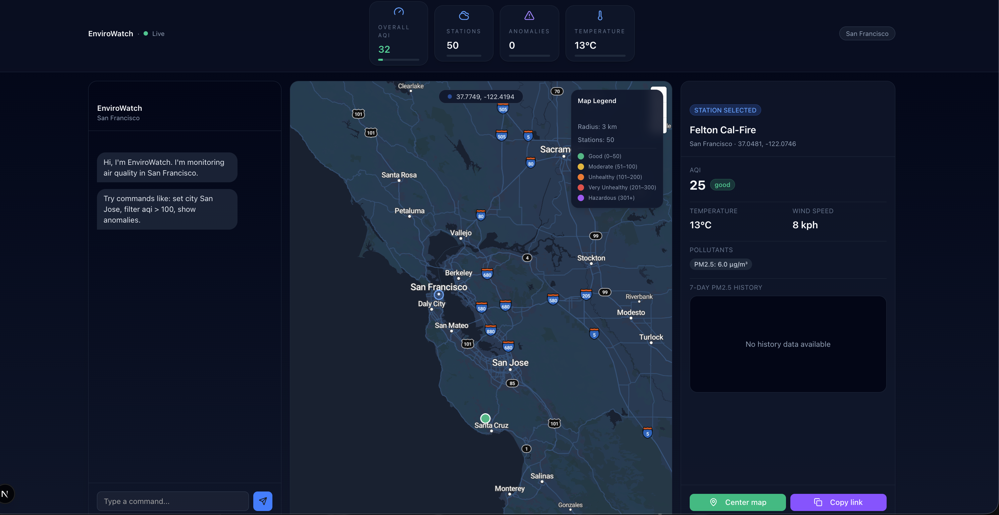

# EnviroWatch

**EnviroWatch** — environmental dashboard for live air quality & anomalies.

🌐 **Live Demo**: [envirowatch-three.vercel.app](https://envirowatch-three.vercel.app)



## Overview

EnviroWatch is a web application that provides real-time environmental monitoring with a beautiful, modern UI. It displays live air quality data from stations around the world, visualizes anomalies, and provides interactive controls through a chat interface.

## Tech Stack

- **Framework**: Next.js 16 (App Router, TypeScript)
- **Styling**: Tailwind CSS v4 with dark mode
- **UI Components**: shadcn/ui
- **State Management**: Zustand
- **Data Fetching**: SWR (via native fetch)
- **Maps**: MapLibre GL JS
- **Charts**: Recharts
- **Animations**: Framer Motion
- **Validation**: Zod
- **Utilities**: date-fns, @turf/turf
- **Icons**: Lucide React

## Live Data Sources

- **Air Quality**: [OpenAQ](https://openaq.org/) (no API key required)
- **Weather**: [Open-Meteo](https://open-meteo.com/) (no API key required)
- **Map Tiles**: MapLibre / MapTiler demo styles (optional MapTiler key for custom styles)

## Features

- **Live AQI Map** with color-coded station markers and circular radius overlay
- **Station Details** with 7-day PM2.5 history charts
- **Anomaly Scoring** computed via z-score vs 7-day median PM2.5
- **Chat Commands** for interactive control:
  - `set city <name>` — Switch to a different city
  - `filter aqi > <N>` — Filter stations by AQI threshold
  - `radius <km>` — Adjust map radius
  - `show anomalies` / `hide anomalies` — Toggle anomaly filter
  - `select <id>` or `select "<name>"` — Select a station
- **Shareable URLs** with query parameters for city, filters, radius, and selected station
- **Dark Theme** with glassy card UI matching Homes.ai aesthetic
- **Responsive Design** with mobile-friendly layout

## Local Development

### Prerequisites

- Node.js 18+ and npm/pnpm/yarn

### Setup

1. **Install dependencies**:
   ```bash
   pnpm install
   # or
   npm install
   ```

2. **Configure environment** (optional):
   Create `.env.local` in the project root:
   ```env
   NEXT_PUBLIC_MAPTILER_KEY=your_key_here
   DEFAULT_CITY=San Francisco
   ```
   
   Note: MapTiler key is optional. The app will use free MapLibre demo tiles if not provided.

3. **Run development server**:
   ```bash
   pnpm dev
   # or
   npm run dev
   ```

4. **Open browser**:
   Navigate to [http://localhost:3000](http://localhost:3000)

## Deployment

### Vercel (Recommended)

1. **Push to GitHub**:
   ```bash
   git init
   git add .
   git commit -m "Initial commit"
   git remote add origin <your-repo-url>
   git push -u origin main
   ```

2. **Import to Vercel**:
   - Go to [vercel.com](https://vercel.com)
   - Click "Import Project"
   - Select your GitHub repository
   - Vercel will auto-detect Next.js settings

3. **Configure Environment Variables** (optional):
   - In Vercel project settings, add:
     - `NEXT_PUBLIC_MAPTILER_KEY` (if using MapTiler)
     - `DEFAULT_CITY` (optional, defaults to "San Francisco")

4. **Deploy**:
   - Vercel will automatically deploy on every push to main
   - Your app will be live at `https://your-project.vercel.app`

### Other Platforms

EnviroWatch can be deployed to any platform that supports Next.js:
- Netlify
- Railway
- Render
- AWS Amplify
- Self-hosted (Node.js server)

## Project Structure

```
envirowatch/
├── app/
│   ├── api/
│   │   ├── openaq/
│   │   │   ├── stations/route.ts    # OpenAQ stations endpoint
│   │   │   └── history/route.ts     # OpenAQ history endpoint
│   │   └── weather/route.ts          # Open-Meteo weather endpoint
│   ├── layout.tsx                     # Root layout with Toaster
│   ├── page.tsx                       # Main dashboard page
│   └── globals.css                    # Global styles
├── components/
│   ├── ui/                            # shadcn/ui components
│   ├── ChatPanel.tsx                  # Left chat panel
│   ├── DetailsPanel.tsx               # Right details panel
│   ├── Legend.tsx                     # Map legend
│   ├── MapView.tsx                    # MapLibre map component
│   └── TopStats.tsx                   # Top stat chips
├── lib/
│   ├── aqi.ts                         # PM2.5 AQI calculation
│   ├── anomaly.ts                     # Anomaly scoring
│   └── geo.ts                         # Map style helper
├── store/
│   └── useAppStore.ts                 # Zustand global state
├── types.ts                           # TypeScript types
└── README.md                          # This file
```

## API Routes

All API routes are serverless functions under `app/api/`:

- `GET /api/openaq/stations?city=<name>` — Fetch latest measurements for a city
- `GET /api/openaq/history?stationId=<id>&parameter=pm25` — Fetch 7-day PM2.5 history
- `GET /api/weather?lat=<lat>&lon=<lon>` — Fetch current weather

## Usage Examples

### Chat Commands

```
set city San Jose
filter aqi > 100
radius 5
show anomalies
select "Downtown"
hide anomalies
```

### URL Parameters

- `?city=San%20Jose` — Set city
- `?aqi_gt=100` — Filter by AQI > 100
- `?radius=5` — Set radius to 5 km
- `?anomalies=1` — Show anomalies only
- `?select=<station_id>` — Select a station

Example: `https://envirowatch.vercel.app?city=Los%20Angeles&aqi_gt=150&radius=10&anomalies=1`

## About

EnviroWatch is a real-time environmental monitoring dashboard that combines live air quality data with an intuitive, Homes.ai-inspired interface. Built with modern web technologies, it provides comprehensive air quality insights through interactive maps, anomaly detection, and natural language commands.

**Key Features:**
- **Real-time Air Quality Monitoring**: Live data from OpenAQ stations worldwide with color-coded visualizations
- **Anomaly Detection**: Automated scoring system that identifies unusual PM2.5 patterns using z-score analysis
- **Interactive Map**: Visual representation of air quality stations with customizable radius overlays
- **Chat Interface**: Natural language commands to filter, search, and explore data intuitively
- **Shareable Links**: URL parameters for easy sharing of specific views and filters
- **Dark Theme UI**: Modern, glassy card-based design optimized for data visualization

Perfect for environmental researchers, data enthusiasts, or anyone interested in monitoring air quality in their area. The dashboard pulls live data from OpenAQ and Open-Meteo APIs, processes it client-side, and presents it in an elegant, user-friendly interface.

## License

MIT

## Credits

- Built with [Next.js](https://nextjs.org/)
- UI components from [shadcn/ui](https://ui.shadcn.com/)
- Air quality data from [OpenAQ](https://openaq.org/)
- Weather data from [Open-Meteo](https://open-meteo.com/)
- Map tiles from [MapLibre](https://maplibre.org/) / [MapTiler](https://maptiler.com/)
